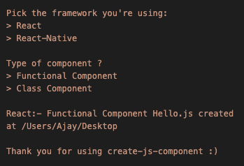

# Create-Js-Component

> A command line tool to create basic react/react-native component

[](https://www.npmjs.com/package/create-js-component) [](https://standardjs.com)

## Install

```bash
npm :- npm install -g create-js-component
yarn :- yarn global add create-js-component

--- or ---

npx :- npx create-js-component Hello.js
```

## Usage

```bash
create-js-component Hello.js
```



## License

MIT © [Ajay](LICENSE)
